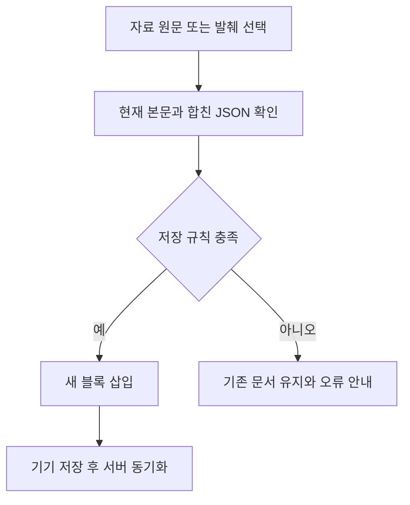

자료를 가져온 뒤 ‘본문에 넣었다’는 안내가 나와도 서버가 저장할 수 없는 문서가 될 수 있었다. **1,001개의 짧은 문단을 가져오는 재현**에서 이 차이가 드러났다. 본문을 바꾸기 전에 서버와 동일한 문서 규칙을 검사하도록 수정했다.

## 문제와 목표

페이지의 자료 패널에서 메모 전체를 본문에 넣으면 화면에는 정상적으로 나타났다. 그러나 페이지는 최대 1,000개 블록만 저장할 수 있다. 문단 하나가 짧더라도 블록 수가 한도를 넘으면 서버 반영이 거절된다.

기존 가져오기는 문서의 전체 크기를 확인했지만 블록 수·중첩·문자열·링크 규칙을 모두 확인하지 않았다. 목표는 사용자가 넣기 버튼을 누를 때 저장할 수 있는지 판단하고, 거절된 경우에는 기존 문서와 원본 자료를 그대로 유지하는 것이다.

## 접근과 변경

### 서버와 같은 검증기를 사용한다

서버의 순수 문서 검증 코드를 공통 모듈로 옮기고 기존 서버의 함수·오류 클래스는 그대로 재노출했다. 프론트에서는 현재 본문과 새로 넣을 내용을 합친 문서를 이 검증기에 전달한다.

규칙을 프론트에 따로 복제하지 않은 이유는 다음 변경에서도 허용 기준이 달라지지 않게 하기 위해서다. 문서 크기는 브라우저에서도 사용할 수 있는 UTF-8 계산으로 확인한다.

### 전송할 JSON 형태를 검사한다

첫 통합 확인에서는 정상적인 짧은 발췌까지 거절됐다. 편집기 내부 속성 객체가 일반 JSON 객체와 다르게 만들어져 있었기 때문이다.

검사 대상은 실제 저장 경로가 보내는 JSON 형태로 맞췄다. 편집기 내부 객체를 JSON으로 직렬화·복원한 다음 검증하고, 성공했을 때만 새 블록을 삽입한다. 빈 페이지에 템플릿을 적용할 때도 보존되는 기존 참조까지 합쳐 검사한다.

### 실패해도 다시 선택할 수 있게 한다

자료 패널은 삽입 중 발생한 오류를 표시하고 성공 안내를 띄우지 않는다. 선택한 원문은 유지하므로 사용자가 필요한 부분만 더 짧게 선택해 다시 넣을 수 있다. 검색어·자료 종류를 바꾸면 이전 자료 읽기를 취소해 잘못된 원문이 뒤늦게 나타나는 것도 막는다.

## 검증 결과

2026년 10월 3일 임시 저장소와 Chrome에서 다음을 확인했다. 실제 사용자 자료로 실패 테스트를 수행하지 않았다.

| 확인한 상황 | 실제 결과 |
| --- | --- |
| 1,001개의 문단 가져오기 | 삽입 전에 거절, 대상 본문·버전·원본 유지 |
| 짧은 발췌 가져오기 | 선택한 부분만 본문 끝에 추가 |
| 새 템플릿 저장 후 재열람 | 제목과 날짜별 일정표 유지 |
| 오프라인 생성 후 재연결 | 기기 문서를 다시 열고 서버 반영 확인 |
| AI 결과 가져오기 | 별도로 저장된 출처 URL·제목 유지 |
| 좁은 화면과 다크모드 | 선택창·자료 패널·키보드 포커스 확인 |

공통 검증기·페이지 API·템플릿·여행·Markdown의 집중 테스트 **28개가 통과**했고 TypeScript와 Vite 빌드도 통과했다. 기존 일정 인라인 편집의 브라우저 검증은 14개 시나리오를 확인했다.

이 수치는 이번 검증 범위다. 기존 빌드의 큰 청크 경고는 남아 있고 실제 iOS·Android의 저장 내구성과 Oracle 배포는 별도 확인 대상이다.

## 남은 과제

- [ ] 실제 휴대폰에서 큰 글을 읽고 필요한 부분을 선택하는 동작 확인
- [ ] 문서 한도 오류가 다음 행동을 충분히 알려주는지 실제 사용으로 검토
- [ ] 첨부와 연결 문서를 가져오는 후속 기능의 범위 결정

성공 기준은 오류가 전혀 없다는 표현이 아니다. **본문이 바뀌었다는 안내와 실제 저장 가능 여부가 일치하는지**를 계속 확인해야 한다.

## 참고 자료

- 문서 작성 흐름 검증 보고서: 템플릿·자료 삽입·오프라인·화면 검증의 근거.
- 공통 페이지 검증기: 크기, 블록 수, 중첩, 표, 링크의 실제 저장 규칙.
- 블록 수 초과 회귀 확인: 원본과 대상 문서·버전이 유지되는지 검사.

이 문서는 실제 작업 기록을 바탕으로 작성했다. 새 개발 작업이나 배포 완료를 뜻하지 않는다.
