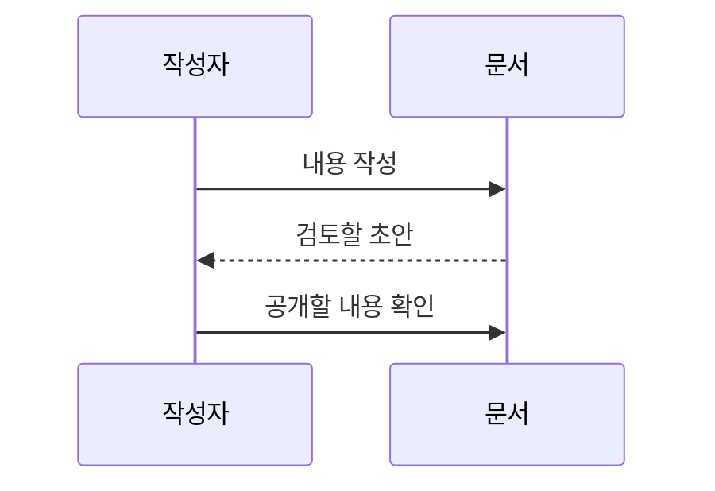
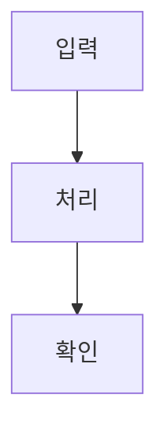

# Anotar · Markdown과 문서 작성 가이드

Anotar에서 쓸 수 있는 Markdown 문법과 문서 블록을 모았습니다. 각 절의 **입력 예시**는 복사할 원문이고, **표시 예시**는 편집기에서 보이는 결과입니다. 문서를 작성할 때 옆에 열어 두고 필요한 절만 참고하세요.

이 안내는 2026년 10월 7일 로컬 구현 기준입니다. Markdown 전체 표준을 지원하는 것은 아니며, 현재 지원 범위와 변환 시 빠지는 정보를 마지막 절에 정리했습니다.

이 위치에는 편집기의 목차 블록을 넣습니다.

# 1. 먼저 알아둘 입력 방식

## 1.1 직접 입력과 붙여넣기

빈 줄에서 `#`, `-`, `1.` 같은 기호를 입력하고 스페이스를 누르면 해당 블록으로 바뀝니다. 이미 작성한 여러 줄의 Markdown은 한꺼번에 붙여넣어도 됩니다. 기호를 외우기 어렵다면 빈 줄에서 `/`를 입력하고 블록 이름을 검색하세요.

- **직접 입력**: 문법 단축 입력으로 블록을 만듭니다.
- **붙여넣기**: Markdown을 읽어 제목·목록·표·코드 등으로 변환합니다.
- **Markdown 보기 / 복사**: 작성한 블록을 Markdown 텍스트로 내보냅니다.

주의할 차이는 `>`입니다. 직접 입력 후 스페이스를 누르면 **접는 목록**이 되고, Markdown의 `> 인용문`을 붙여넣으면 **인용 블록**이 됩니다. 직접 입력으로 인용을 만들 때는 `"` 뒤에 스페이스를 누릅니다.

## 1.2 페이지 제목과 본문 제목

맨 위 페이지 제목은 본문과 별도입니다. 본문 `#`는 큰 장, `##`는 장 안의 주제, `###`는 세부 설명에 사용하세요. 이 가이드도 같은 구조를 사용합니다. 목차에 표시할 큰 장에는 `1.`, `2.`처럼 번호를 붙이면 읽는 순서가 분명해집니다.

# 2. 제목·문단·줄바꿈

## 2.1 제목은 네 단계

**입력 예시**

```markdown
# 1. 큰 장
## 1.1 장 안의 주제
### 세부 설명
#### 더 작은 제목
```

`#`와 제목 사이에 공백을 넣습니다. 보통 문서는 1~3단계면 충분합니다. 단계는 글자 크기만 바꾸는 장식이 아니라 문서의 관계를 나타냅니다. 위의 실제 장·절 제목이 표시 예시입니다.

#### 제목 4 표시 예시

제목 4도 본문보다 조금 크고 굵게 표시됩니다. 작게 프리셋의 본문은 14px, 제목 4는 15.12px입니다. 새로 붙여넣는 5·6단계 제목은 내용은 보존하고 제목 4로 표시합니다. 노션의 본문 제목은 1~3단계이며 Anotar는 요청에 따라 4단계까지 제공합니다.

## 2.2 빈 줄은 문단을 나눕니다

**입력 예시**

```markdown
첫 문단은 핵심을 설명합니다.

두 번째 문단은 근거를 설명합니다.
```

**표시 예시**

첫 문단은 핵심을 설명합니다.

두 번째 문단은 근거를 설명합니다.

## 2.3 같은 문단 안에서 줄을 바꾸기

### Markdown을 붙여넣을 때

줄 끝에 **공백 두 칸**을 넣고 줄을 바꾸세요. 아래 첫 줄의 끝에 보이지 않는 공백 두 칸이 있습니다.

```markdown
첫 번째 줄입니다.  
같은 문단의 두 번째 줄입니다.
```

**표시 예시**

첫 번째 줄입니다.  
같은 문단의 두 번째 줄입니다.

### 편집기에서 직접 쓸 때

`Enter`는 다음 블록으로 이동하고, `Shift+Enter`는 현재 블록 안에서 줄을 바꿉니다. 단순히 화면 폭이 좁아져 생긴 자동 줄바꿈과 직접 넣은 줄바꿈은 다릅니다. 화면 폭에 따라 읽히도록 일반 문장은 중간에 임의로 끊지 않는 편이 좋습니다.

# 3. 강조·인라인 코드·링크

## 3.1 문장 안의 서식

**입력 예시**

```markdown
**핵심 결론**, *보충 강조*, ***굵고 기울인 강조***, ~~취소한 계획~~
실행 명령은 `npm run dev`입니다.
```

**표시 예시**

**핵심 결론**, *보충 강조*, ***굵고 기울인 강조***, ~~취소한 계획~~

실행 명령은 `npm run dev`입니다.

파일명·명령·속성 이름에는 인라인 코드를 쓰고, 긴 프로그램에는 코드 블록을 쓰세요. 편집기에서는 글자를 선택한 뒤 서식 도구로 굵게·기울임·취소선·밑줄·코드·링크 등을 적용할 수도 있습니다. 밑줄과 글자색은 표준 Markdown으로 그대로 옮겨지지 않습니다.

## 3.2 링크에는 읽을 수 있는 이름을

**입력 예시**

```markdown
[Anotar 사용법과 기술 구조](/pages/546e1325-762b-4ea4-9ce5-a37e4c43d2b5)
[BlockNote 공식 문서](https://www.blocknotejs.org/docs)
```

**표시 예시**

[Anotar 사용법과 기술 구조](/pages/546e1325-762b-4ea4-9ce5-a37e4c43d2b5)

[BlockNote 공식 문서](https://www.blocknotejs.org/docs)

개인 페이지의 `/pages/...` 주소는 로그인한 작업 공간 안의 이동 주소입니다. 이 링크를 글에 넣었다고 대상 페이지가 공개되는 것은 아닙니다. 외부 공유용 주소는 페이지 상단의 **공유**에서 따로 발급합니다.

## 3.3 기호를 글자 그대로 쓰기

문법 기호 앞에 역슬래시를 붙이면 기호를 문자로 표현할 수 있습니다. 코드 영역 안에서는 문법을 다시 해석하지 않습니다.

```markdown
\*강조가 아닌 별표\*
\# 제목이 아닌 문장
```

**표시 예시**

\*강조가 아닌 별표\*

\# 제목이 아닌 문장

코드 안에 역따옴표가 들어가면 바깥을 두 개로 감싸세요.

```markdown
``문장 안의 `역따옴표`까지 코드로 표시``
```

**표시 예시**

``문장 안의 `역따옴표`까지 코드로 표시``

# 4. 목록·할 일·들여쓰기

## 4.1 글머리와 번호 목록

**입력 예시**

```markdown
- 첫 번째 준비물
- 두 번째 준비물

1. 자료를 모읍니다.
2. 결론을 정리합니다.
3. 공유 전에 확인합니다.
```

**표시 예시**

- 첫 번째 준비물
- 두 번째 준비물

1. 자료를 모읍니다.
2. 결론을 정리합니다.
3. 공유 전에 확인합니다.

글머리 기호는 `* 항목`으로도 쓸 수 있습니다. 순서가 중요하면 번호 목록, 순서가 중요하지 않으면 글머리 목록을 사용하세요.

## 4.2 할 일 체크박스

**입력 예시**

```markdown
- [ ] 문서 검토하기
- [x] 작성 범위 정하기
```

**표시 예시**

- [ ] 문서 검토하기
- [x] 작성 범위 정하기

`[ ]` 안에는 공백 하나를 넣습니다. 본문의 체크 목록은 문서 블록이며, 별도 **할 일** 화면의 항목과 자동으로 연결되지는 않습니다. 이 가이드의 체크박스는 설명용 예시입니다.

## 4.3 중첩과 일반 들여쓰기

**입력 예시**

```markdown
- 큰 주제
    - 하위 주제
        - 세부 항목
```

**표시 예시**

- 큰 주제
    - 하위 주제
        - 세부 항목

직접 편집할 때는 `Tab`으로 바로 위 블록 안에 넣고 `Shift+Tab`으로 꺼냅니다. 왼쪽 손잡이 메뉴에서도 들여쓰기와 내어쓰기를 고를 수 있습니다. 자식 묶음 옆의 옅은 점선은 깊이를 보여 주는 안내선입니다. 인용문의 실선과는 다른 표시입니다.

# 5. 인용·구분선·접기

## 5.1 인용은 출처가 있는 문장에

**붙여넣을 Markdown**

```markdown
> 다른 문서에서 가져온 문장을 표시합니다.
> 같은 인용 안의 다음 문장입니다.
```

**표시 예시**

> 다른 문서에서 가져온 문장을 표시합니다.
> 같은 인용 안의 다음 문장입니다.

실제 인용에는 작성자·문서명·출처 링크를 함께 적으세요. 빈 줄에서 직접 인용 블록을 만들려면 `"`와 스페이스를 입력하거나 `/인용`을 고릅니다.

## 5.2 주제가 바뀌는 지점에 구분선

**입력 예시**

```markdown
---
```

**표시 예시**

---

구분선 앞뒤에 빈 줄을 두세요. 문장 바로 아래의 `---`는 Markdown에서 제목으로 해석될 수 있습니다. 짧은 문단마다 선을 넣기보다 큰 주제가 바뀌는 곳에 사용하세요.

## 5.3 접는 목록과 접는 제목

접기는 편집기 전용 기능입니다. `/접을 수 있는 목록` 또는 `/접을 수 있는 제목`으로 만들고, 안에 넣을 블록을 `Tab`으로 들여쓰세요. 제목 1~3단계에도 접기를 적용할 수 있습니다. 접힌 화살표를 누르면 자식 블록이 펼쳐집니다.

접기 예시 · 화살표를 눌러 보충 설명 보기

결론은 밖에 두고 로그·세부 근거·긴 설명을 접어 두면 읽기 편합니다. 점선 테두리는 콜아웃과 구별되는 접기 표시입니다. 일반 Markdown에는 이 접기 상태와 모양을 그대로 옮기는 문법이 없습니다.

# 6. 표와 너비 조절

## 6.1 머리글과 구분 행이 필요합니다

**입력 예시**

```markdown
| 요소 | 언제 쓰나요? | 예시 |
| --- | --- | --- |
| 목록 | 같은 성격의 항목 | 준비물 |
| 번호 목록 | 진행 순서 | 작업 절차 |
| 표 | 같은 기준으로 비교 | 역할 비교 |
```

**표시 예시**

| 요소 | 언제 쓰나요? | 예시 |
| --- | --- | --- |
| 목록 | 같은 성격의 항목 | 준비물 |
| 번호 목록 | 진행 순서 | 작업 절차 |
| 표 | 같은 기준으로 비교 | 역할 비교 |

표는 행마다 열 수를 맞추세요. 긴 설명을 여러 셀에 억지로 나누기보다 표 아래 일반 문단으로 풀어 쓰는 편이 낫습니다. 셀 안에서 줄을 강제로 나누면 화면 폭을 바꿨을 때 읽기 어려워질 수 있습니다.

## 6.2 본문 너비에 맞추기

표 왼쪽 손잡이 메뉴의 **본문 너비에 맞추기**를 누르면 열이 현재 본문 폭에 균등하게 배치됩니다. 이후 열 경계를 끌어 폭을 조절할 수 있습니다. 좁은 화면에서는 표 영역 안에서 가로로 스크롤합니다.

Markdown 표 원문에는 Anotar의 열 너비가 저장되지 않습니다. 셀 서식·머리글 모양을 정확히 보존하려면 원본 블록 JSON을 유지하세요. 현재 표에는 데이터베이스 필터나 수식 기능이 없습니다.

# 7. 코드 블록과 언어별 색상

## 7.1 세 개의 역따옴표로 감쌉니다

**입력 예시**

````markdown
```javascript
const message = "Anotar";
console.log(message);
```
````

**표시 예시**

```javascript
const message = "Anotar";
console.log(message);
```

첫 줄의 언어명이 구문 강조에 사용됩니다. 블록에 마우스를 올리거나 키보드 초점을 두면 오른쪽 도구에서 언어를 바꾸고 **복사**를 누를 수 있습니다. 터치 화면에서는 도구를 바로 표시합니다. 복사는 현재 코드의 공백·줄바꿈을 유지하며 언어명이나 Markdown 울타리를 포함하지 않습니다. 성공하면 **복사됨**, 권한 등으로 실패하면 **복사 실패**와 직접 선택해 복사하라는 안내를 표시합니다. 공유·오프라인 HTML에도 복사 버튼이 있습니다. 언어를 일반 텍스트로 바꾸면 색상 강조가 사라집니다. 코드는 표시용이며 페이지에서 자동 실행하지 않습니다.

## 7.2 현재 선택 가능한 언어

일반 텍스트, JavaScript, TypeScript, JSX, TSX, Python, SQL, Bash / Shell, JSON, HTML, CSS, YAML, Markdown, Java, C, C++, C#, Go, Rust, Dockerfile, Diff, Mermaid를 고를 수 있습니다.

흔히 쓰는 별칭은 `js`, `ts`, `py`, `sh`, `yml`, `md`입니다. Mermaid는 다음 절의 다이어그램으로 작성하면 그림으로 볼 수 있습니다.

**명령과 설정 예시**

```bash
# 예시 명령입니다. 실행할 경로를 먼저 확인하세요.
npm run dev:oracle
```

```json
{
  "title": "문서 제목",
  "status": "draft"
}
```

## 7.3 코드 울타리 자체를 보여 주기

안에 세 개의 역따옴표가 들어갈 때 바깥 울타리를 네 개로 만들면 됩니다. 이 절의 첫 입력 예시도 그 방법으로 작성했습니다. 인라인 코드와 코드 블록은 서로 다른 기능입니다.

# 8. Mermaid 다이어그램

## 8.1 흐름도 작성하기

`mermaid` 언어의 코드 울타리를 붙여넣으면 다이어그램 블록으로 변환합니다. `/다이어그램`으로 빈 블록을 만든 뒤 소스를 작성해도 됩니다.

**입력 예시**

````markdown

````

**표시 예시**


`LR`은 왼쪽에서 오른쪽, `TD`는 위에서 아래입니다. `A`, `B`는 노드 식별자이며 대괄호 안의 글자가 화면에 표시됩니다. 모바일에서 너무 길면 `TD`로 방향을 바꾸거나 흐름을 작게 나누세요.

## 8.2 주고받는 순서는 시퀀스 다이어그램

**입력 예시**

````markdown

````

**표시 예시**


위 그림은 작성 순서를 보여 주는 설명용 예시입니다. 실제 서버 동기화 통신 규격을 뜻하지 않습니다.

## 8.3 수정·확대·오류 확인

다이어그램에 마우스를 올리면 **소스 수정**과 **확대 보기**가 나타납니다. 소스는 Mermaid로 고정되며 일반 코드 블록의 언어 선택과 다릅니다. 문법 오류가 나면 원문은 남고 오류 안내가 표시됩니다. 그래프 전체의 의미를 짧은 문장으로 먼저 설명하고, 그림을 그 문장의 보충 자료로 쓰면 좋습니다.

# 9. 콜아웃·목차·문서 구성

## 9.1 콜아웃은 중요한 안내에

`/콜아웃`으로 만듭니다. 기본은 투명 배경과 얇은 테두리입니다. 왼쪽 아이콘의 모양 설정에서 투명·배경색, 아이콘, 테두리를 바꿀 수 있습니다. 아이콘은 아이디어·안내·주의·확인·없음 중에서 고릅니다. 왼쪽 블록 메뉴의 **콜아웃 아이콘 → 아이콘 없음**으로 빈자리까지 없앨 수도 있습니다.

콜아웃 예시 · 중요한 안내를 여기에 모읍니다.

박스 안에서는 일반 글·굵게·인라인 코드·링크를 사용할 수 있습니다. `Shift+Enter`로 내부 줄을 바꾸고, `Tab`으로 자식 블록을 넣습니다. 같은 성격의 콜아웃을 연달아 쌓기보다 한 박스에 필요한 안내를 모아 주세요.

## 9.2 목차는 제목에서 자동으로 만듭니다

`/목차`를 한 번 넣습니다. 제목 블록을 추가하거나 고치면 목차도 바뀝니다. 손잡이 메뉴에서 **대표 제목만 목차에 표시** 또는 **소제목까지 목차에 표시**를 고를 수 있습니다. 긴 글에서는 큰 장만 표시하고 세부 절은 본문에서 읽는 구성이 간결합니다.

이 가이드 상단의 목차가 실제 예시입니다. 목차처럼 보이는 별도 링크 목록을 다시 만들 필요가 없습니다. 목차는 Markdown 내보내기에 포함되지 않으므로 다른 문서에서 필요하면 다시 넣어 주세요.

## 9.3 좋은 설명서의 기본 순서

1. 무엇을 설명하는지 짧게 소개합니다.
2. 먼저 필요한 결론이나 전체 흐름을 보여 줍니다.
3. 제목과 소제목으로 내용을 나눕니다.
4. 입력 예시, 결과, 주의사항을 가까이 둡니다.
5. 관련 링크와 확인 날짜를 남깁니다.

표는 비교, 다이어그램은 관계와 흐름, 코드 블록은 원문, 접기는 보충 설명에 사용하세요. 모든 정보를 박스로 감싸거나 모든 문장에 굵게를 넣으면 우선순위가 흐려집니다.

# 10. 페이지·북마크·이미지·첨부

## 10.1 새 하위 페이지와 기존 페이지 연결

`/페이지`는 새 하위 페이지를 만들고 현재 문서에 이동 블록을 넣습니다. 기존 페이지는 **더보기 → 페이지 링크 복사** 후 다른 문서의 빈 줄에 붙여넣어 **페이지 링크**를 선택하세요. 사이드바에서 하위에 배치하는 것과 본문에 이동 블록을 넣는 것은 별개의 작업입니다.

페이지 연결 예시 · 사용법과 기술 구조 열기

연결은 이동 경로이며 대상 문서를 복사하거나 공개하는 기능이 아닙니다. 대상 페이지를 휴지통으로 옮기면 링크가 열리지 않을 수 있습니다.

## 10.2 URL 북마크

URL 하나를 빈 줄에 붙여넣으면 일반 링크 또는 북마크를 선택할 수 있습니다. 북마크는 가져온 제목·설명·대표 이미지 사본을 표시합니다. 정보를 읽지 못하면 일반 링크를 남기고 나중에 다시 확인하세요. Markdown으로 내보내면 제목 링크와 설명이 남고 북마크 이미지 사본은 함께 옮겨지지 않습니다.

## 10.3 이미지는 실제 파일을 첨부합니다

일반 Markdown의 아래 문법은 알고 있어도 됩니다. 다만 **현재 Anotar는 이 외부 이미지 URL을 자동으로 내려받아 이미지 블록으로 만들지 않습니다.**

```markdown

```

이미지·파일은 **더보기 → 파일 첨부**로 넣으세요. 메모의 **내 페이지에 정리**를 사용하면 보관한 내용과 첨부를 문서에 가져올 수도 있습니다. 문서에는 파일 참조가 들어가고 실제 파일 바이트는 별도로 보관됩니다.

페이지 공유는 현재 페이지 본문에 직접 배치한 첨부만 공개합니다. 하위 페이지·연결된 개인 페이지의 본문을 함께 공개하지 않습니다.

## 10.4 이모지와 대표 아이콘

본문에서 `:` 또는 `/이모지`로 선택창을 열 수 있습니다. 제목 위의 대표 아이콘은 본문 이모지와 별도입니다. 의미를 구별하는 데 도움이 되는 곳에만 사용하세요.

# 11. 편집·글자 크기·저장

## 11.1 블록 이동과 계속 쓰기

왼쪽 손잡이를 끌어 블록 순서를 바꿉니다. 여러 블록을 선택하면 다른 페이지로 옮기거나 AI 요청에 사용할 수 있습니다. 본문 아래 빈 공간을 누르면 마지막 문단에서 이어 쓸 수 있습니다. 한 문단에는 한 가지 주제만 담고 긴 문장은 나눠 주세요.

## 11.2 폰트와 크기는 설정에서

**설정 → 화면**에서 시스템 글꼴을 Pretendard 또는 RIDIBatang으로 바꿀 수 있습니다. 페이지 글자 크기는 **작게·보통·크게**를 고르고 제목 1·2·3·4 비율, 줄간격, 문단 간격도 조절할 수 있습니다. 현재 기본은 **작게(본문 14px)**입니다. 제목 4도 본문보다 크게 표시되도록 비율 하한을 둡니다.

오른쪽 **기본값으로 설정**은 현재 값을 새로운 기본으로 만드는 버튼이 아니라, 본문·제목·간격을 처음의 작은 크기 설정으로 되돌리고 저장하는 버튼입니다. 공유 화면의 글자 크기도 기본은 작게이며 독자가 자신의 브라우저에서 바꿀 수 있습니다. 크기 선택은 문서 본문을 바꾸지 않습니다.

## 11.3 기기 저장과 서버 반영은 다릅니다

입력은 기기에 먼저 저장하고 서버에 모아 전송합니다. **기기에 저장됨**과 **서버에 반영됨**은 서로 다른 확인입니다. 공개 공유 페이지에는 서버에 반영된 본문이 표시됩니다. 서로 다른 변경이 충돌하면 해당 페이지에서 양쪽 사본을 비교하고 반영할 내용을 선택하세요.

# 12. Markdown 내보내기와 지원 한계

## 12.1 원본은 블록 JSON

Anotar 페이지는 `schemaVersion: 1`의 블록 JSON으로 저장됩니다. Markdown은 붙여넣기·보기·복사·AI 입력에 쓰는 교환 형식입니다. `.md`만 보관해도 모든 모양과 연결이 완전히 복원되는 것은 아닙니다.

| 기능 | Markdown으로 옮길 때 |
| --- | --- |
| 문단·제목·목록·강조·링크 | 일반적인 텍스트 구조를 표현 |
| 코드·Mermaid | 언어명과 소스를 코드 울타리로 표현 |
| 표 | 셀 내용은 표현하지만 열 너비는 보존하지 않음 |
| 콜아웃 | 본문을 인용문으로 표현; 색·아이콘·테두리는 빠짐 |
| 접기 | 접기 모양과 상태를 그대로 보존하지 않음 |
| 목차 | 내보내기에서 제외 |
| 페이지 링크 | 개인 앱의 이동 주소이며 대상 본문은 포함하지 않음 |
| 첨부 | 앱 전용 참조 설명이며 파일 바이트는 포함하지 않음 |
| 원본 메모 관계 | 내보내기에서 제외 |

읽을 수 있는 사본이 필요하면 오프라인 HTML 내보내기를, 정확한 복원이 필요하면 DB와 첨부를 함께 백업하는 방식을 사용하세요. AI에 문서를 요청해도 링크 대상의 본문이나 파일 바이트가 자동으로 전달되는 것은 아닙니다.

## 12.2 현재 보존을 보장하지 않는 문법

- 각주: `[^1]`과 각주 정의
- 수식: `$...$` 또는 `$$...$$`
- 정의 목록·MDX·임의 HTML
- 외부 이미지 URL의 자동 이미지 첨부
- 밑줄·글자색·배경색 등 표준 Markdown에 없는 모양

지원되지 않는 문법을 쓰면 일반 글자로 남거나 구조가 바뀔 수 있습니다. 중요한 문서를 옮길 때는 코드·표·링크와 첨부를 실제 화면에서 확인하세요. 문서당 최대 1,000개 블록, 중첩 깊이 8단계, 표당 200행·30열 제한이 있습니다.

# 13. 바로 복사할 문서 틀

아래는 기능 설명서용 빈 틀입니다. 중괄호 부분은 실제로 확인한 내용으로 바꾸세요. 확인하지 않은 기능·수치·검증 결과를 사실처럼 채우지 마세요. 긴 글에는 붙여넣은 뒤 `/목차`를 한 번 추가하면 됩니다.

````markdown
# 1. 무엇을 설명하나요?

{대상 독자와 이 글을 읽고 할 수 있는 일을 두 문장으로 설명합니다.}

## 1.1 먼저 알아둘 것

- {필요한 준비}
- {현재 지원하는 범위}

# 2. 사용 순서

1. {첫 번째 작업}
2. {두 번째 작업}
3. {결과 확인}

## 2.1 입력 예시

```json
{
  "title": "실제 입력 예시"
}
```

## 2.2 결과와 주의사항

{어떤 결과가 보이며, 실패하면 무엇을 확인할지 씁니다.}

# 3. 관계와 흐름



# 4. 확인과 다음 할 일

- [ ] {완료 기준이 있는 확인 항목}
- [ ] {다음 작업}

## 4.1 변경 기록

| 날짜 | 바뀐 내용 | 확인 범위 |
| --- | --- | --- |
| {YYYY-MM-DD} | {실제 변경} | {직접 확인한 것} |

## 4.2 참고 자료

[출처 이름](https://example.com/)
````

# 14. 에이전트가 문서를 작성할 때

현재 MCP 연결은 아직 추가하지 않았습니다. 나중에 연결하더라도 아래 기준을 지키면 문서의 모양과 사용자 자료를 보존하기 쉽습니다.

1. 먼저 현재 페이지와 버전을 읽습니다. 작성 전에 확인한 원본을 보관합니다.
2. 일반 문장은 Markdown으로 작성하고, 목차·콜아웃·접기·표 너비처럼 전용 속성이 필요한 부분은 블록 JSON으로 표현합니다.
3. 기존 블록을 고칠 때 ID를 유지합니다. 전체 내용을 새 블록으로 바꾸면 댓글·참조의 연결에 영향을 줄 수 있습니다.
4. 저장할 때 `expectedVersion`을 포함합니다. 버전이 바뀌었으면 다시 읽고 비교하며 강제로 덮어쓰지 않습니다.
5. 첨부·페이지 참조는 실제 ID를 사용합니다. 링크만 넣고 파일이 옮겨졌거나 페이지가 공유됐다고 설명하지 않습니다.
6. 공유·휴지통 이동은 문서 작성과 별도 작업으로 다룹니다. 최종 페이지를 읽어 본문과 저장 결과를 확인합니다.

원본과 예시를 같이 보면서 필요한 절만 복사해 사용하세요. **사용법과 기술 구조**는 서비스 전체 흐름, 이 가이드는 문서를 쓰는 방법을 설명합니다.
