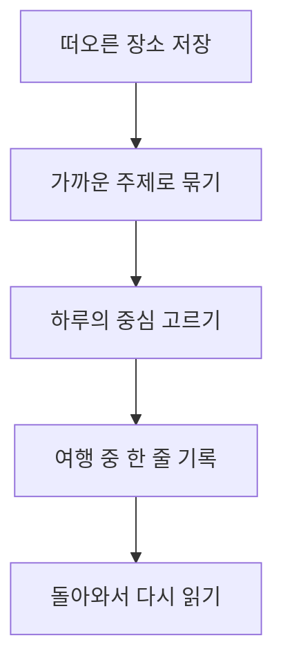

# 교토의 3일, 많이 보기보다 오래 머무르기

여행에서 돌아온 뒤 가장 오래 기억하는 건 방문한 장소의 개수가 아니다. 우연히 들어간 골목, 쉬어 간 자리에서 나눈 대화, 그날 저녁의 공기 같은 것들이다. 이번 교토 여행은 **하루에 하나의 중심만 정하고** 나머지는 그날의 기분에 맡기기로 했다.

예전에는 ~~하루에 다섯 곳을 돌아보는 일정~~을 좋은 계획이라고 생각했다. 이번에는 *한 장소를 조금 더 오래 보는 시간*을 남기고 싶다. 계획표는 길을 잃지 않기 위한 지도이지, 따라야만 하는 시간표가 아니다.

> 돌아와서도 이야기하고 싶은 장면 하나가 있다면, 그날은 충분히 잘 보낸 것이다.

## 여행의 기준

1. 매일 가장 가고 싶은 곳 하나를 먼저 고른다.
2. 식사와 이동 사이에는 빈 시간을 둔다.
3. 비가 오거나 피곤하면 일정을 줄인다. 쉬는 시간도 여행의 일부다.

장소를 저장할 때는 [지도를 열어](https://www.openstreetmap.org/) 대략적인 방향만 확인한다. 정확한 이동 순서는 전날 저녁에 정한다.

## 3일의 흐름

| 날      | 하루의 중심     | 느슨한 계획                                | 저녁에 남길 기록      |
| ------- | --------------- | ------------------------------------------ | --------------------- |
| 첫째 날 | 도착과 적응     | 숙소 주변을 걷고 마음에 드는 가게를 찾기   | 첫인상 한 문장        |
| 둘째 날 | 기온 주변       | 골목을 천천히 걷고 쉬고 싶은 곳에서 멈추기 | 다시 걷고 싶은 길     |
| 셋째 날 | 아라시야마 주변 | 한 장소에 충분히 머문 뒤 돌아오기          | 가장 오래 기억할 장면 |

### 첫째 날 — 낯선 도시의 속도에 맞추기

도착하자마자 명소로 달려가지 않는다. 짐을 놓고 숙소 주변을 한 바퀴 걷는다. 눈에 들어오는 간판과 길의 색을 먼저 기억해 둔다. 저녁에는 다음 날 필요한 것만 확인하고 일찍 쉰다.

### 둘째 날 — 계획보다 발걸음을 믿기

기온 주변에서 시작하되 골목 하나를 더 볼지, 앉아서 쉴지는 그때 결정한다. 사진을 많이 남기려 애쓰기보다 잠깐 휴대폰을 내려놓는다. ***기억에 오래 남는 순간***은 대개 서둘러 찾을 수 없다.

### 셋째 날 — 마지막 장면 고르기

아라시야마 주변에서는 여러 곳을 체크하기보다 마음에 드는 한곳에 머문다. 돌아오는 길에는 이번 여행에서 좋았던 선택 하나와 다음에는 바꾸고 싶은 선택 하나를 적는다.

## 하고 싶은 것과 미뤄둘 것

- 꼭 하고 싶은 것
  - 아침에 걷기 좋은 길을 찾아 천천히 걷기
  - 마음에 드는 식당에서 서두르지 않고 식사하기
- 시간이 남으면 할 것
  - 지나가다 발견한 작은 가게 들르기
  - 같은 장소를 다른 시간에 다시 보기

이번에는 유명한 장소를 전부 보려는 마음을 내려놓는다. **남은 장소는 다음 여행의 이유**가 되면 된다.

## 출발 전 체크

- [x] 하루에 하나의 중심을 정했다.
- [ ] 숙소와 이동 정보를 한곳에 모은다.
- [ ] 날씨를 확인하고 비 오는 날의 선택지를 적어 둔다.
- [ ] 함께 가는 사람에게 이 페이지를 보여주고 원하는 곳을 묻는다.

## 짧은 메모가 여행 기록이 되는 과정

떠오른 장소는 일단 빠르게 저장한다. 나중에 비슷한 방향의 장소를 묶고, 하루의 중심을 고른다. 여행 중에는 기존 계획을 지우지 않고 그날 느낀 것을 덧붙인다.



사진을 정리하기 전에 먼저 문장을 남긴다. 파일 이름에는 `YYYY-MM-DD`를 붙여 날짜순으로 찾기 쉽게 한다.  
그날의 메모에는 장소보다 **왜 그곳이 좋았는지**를 적는다.

```json
{
  "날": "둘째 날",
  "장면": "잠시 멈춰 선 골목",
  "기억": "걷는 속도를 늦추니 보이던 것들"
}
```

## 돌아와서 남길 이야기

### 사진보다 먼저 떠오른 문장

사진을 고르기 전에 여행을 한 문장으로 적는다. 그 문장이 이 페이지의 첫 문단이 된다.

#### 장소를 기억하는 단서

가게 이름보다 그곳에 갔을 때의 날씨, 함께 한 사람의 말, 걷다가 멈춘 이유를 적는다.

##### 다음번에 바꿀 한 가지

욕심냈던 일정 하나를 지우고, 다시 하고 싶은 경험 하나를 남긴다.

###### 한 줄 결론

많이 보는 것보다 오래 기억할 수 있게 여행한다.

---

이 계획은 완성된 답이 아니다. 여행 중 바뀐 일정과 새로 발견한 장소까지 여기에 이어 적으면, 떠나기 전의 기대와 돌아온 뒤의 기억이 한 페이지에 남는다.
